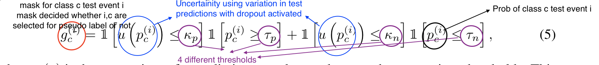
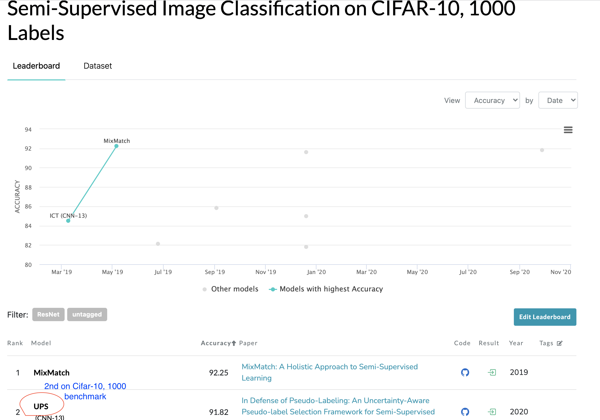
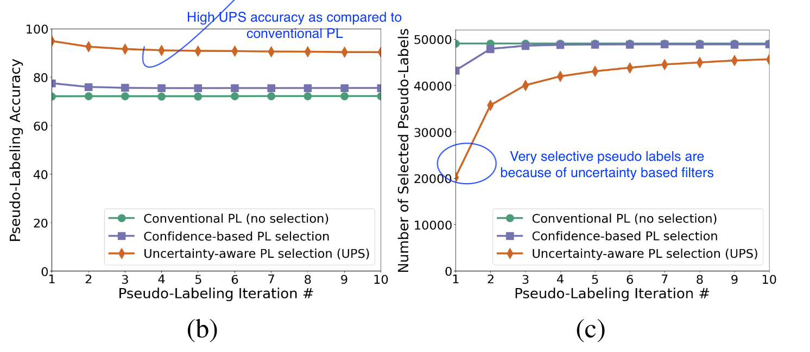

#### [In Defense of Pseudo-Labeling: An Uncertainty-Aware Pseudo-label Selection Framework for Semi-Supervised Learning](https://openreview.net/pdf?id=-ODN6SbiUU)

> *Conference: ICLR 2021 | Authors: Mamshad Nayeem Rizve, Kevin Duarte, Yogesh S Rawat, Mubarak Shah*  

> **Brief background:** 
    Pseudo Labeling (PL) is a semi supervised learning (SSL) approach in which you iteratively train supervised model using labels + pseudo labels. Pseudo labels are generated from the unlabeled data that have high prediction score (above a certain cut-off). In SSL literature, PL is generally beaten by techniques that use domain specific data augmentations for learning patterns from unlabeled data. Data augmentations work great in SSL, but can’t be done for all types of data, e.g. tabular data. On the other hand, PL based approaches do not rely on data augmentations, are more generic, but fail to deliver high performance. The technique in this paper attempts to bridge the performance gap b/w data augmentation based SSL vs. pseudo labeling.

> **Key idea:** 
    Main idea behind this paper is to use the uncertainty of predictions from the test data as additional information before selecting pseudo labels. Traditionally, psuedo labels are generated by filtering predictions on unseen data that have a score 
    **above** certain cut-off. Some relate this cut-off with high confidence (which is not true for all models though). 
    In addition to high cut-off thresholding, authors in this paper propose low cut-off thresholding to emphasize the importance of 
    absence of a class, together with their main idea of selecting only high certain predictions as pseudo labels. 
    *How is uncertainity estimated?* -> Uncertainty of a prediction can be found in neural network by applying dropout during test time and generating prediction for the same input N times. The standard deviation from N predictions (on same input) is used as uncertainty measure.  

> **Important equation to understand:**
    The equation shows that both uncertainity based thresholding and high/low score thresholding  
    

> **One result worth mentioning:** 

> Cifar-100, 1000 labels benchmark            |  Comparison of conventional PL Uncertainity Aware PL 
> :-------------------------:|:-------------------------:
>   |  

