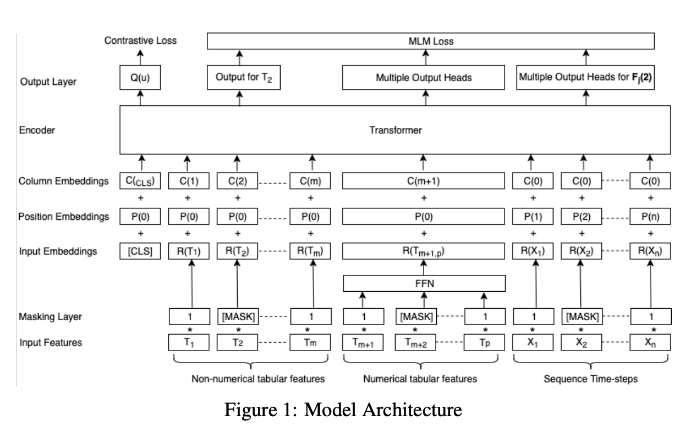
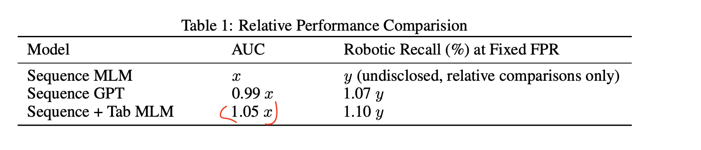

#### [Self-supervised Representation Learning Across Sequential and Tabular Features Using Transformers](https://openreview.net/pdf?id=wIIJlmr1Dsk)

> *Conference: NeurIPS 2022 | Authors: Rajat Agarwal, Anand Muralidhar, Agniva Som and Hemant Kowshik*  

> **Brief background:** 
    In many real world use cases like personalization, recommender systems, fraud detection, ad response prediction etc., data that is used for modeling comes in the
    form of A) sequence of events, e.g. clickstream, sequence of sign-ins from a user, sensor data, time series etc., B) tabular features in categorical and numerical formats, e.g. user information like email address, geolocation, or transaction information, like invoice amount, products bought etc. These two categories of features (sequence and tabular) can be combined together to learn representations using self supervision (i.e. no explicit labels) and those representations can be used in downstream tasks like fraud detection. It is noted that using such representations work better than directly using raw features for the same downstream tasks, or if either using only sequence information or only tabular information.

> **Key idea:** 
    The key idea in this paper is to combine self-supervision for both tabular and sequence data in a transformer architecture using A) positional encoding for sequential features, and B) column encoding for tabular features. As a recap, in transformer architecture, we define a self supervision task by asking the neural network to predict randomly masked tokens (in language) or pixels (in images). The neural network uses self attention mechanism, treating input 
    sequence (a sentence) as bag of tokens where the order of token is maintained by passing a positional encoding during the training process. The key idea in this paper is that, smilar to how we treat sequence of words in a transformer via positional encoding, we can treat any sequence of items, like clickstream the same way. And similar to how it is important to retain sequence information via positional encodings, it is also important for tabular data to retain column information as different columns in a table have different meanings. So for tablular data, we can use additional column encodings. The self supervision task 
    can be same as in regular transform model, which is to predict randomly masked entries.   

> **Important equation to understand:**
    Loss functions are 1) For masked token prediction task: masked token can be either a numerical feature or a categorical feature. For numerical feature, they used MSE, for categorical they used cross entropy loss and simply added those together. In addition, their network also learns a <cls> token via contrastive loss. This token is appended to every input and model learns to keep embedding of token close for inputs that correspond to same entity (e.g. two transactions from same user) and far for randomly chosen pairs (e.g. two transactions from different users). This token is also used in inference time as final embedding of
    a new input row to be used in downstream tasks.   
    

> **One result worth mentioning:** 

> Model Architecture            | Result on a downstream task
> :-------------------------:|:-------------------------:
>   |  

