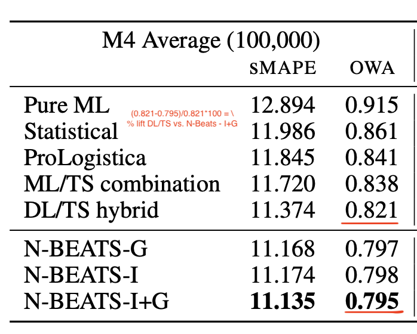

#### [N-BEATS: NEURAL BASIS EXPANSION ANALYSIS FOR INTERPRETABLE TIME SERIES FORECASTING](https://arxiv.org/pdf/1905.10437.pdf)

> *Conference:  ICLR 2020 | Authors: Boris N. Oreshkin, Dmitri Carpov, Nicolas Chapados and Yoshua Bengio*  

> **Brief background:** 
    Makridakis et al. (2018b) argued that "hybrid approaches and combinations of method are the way forward for improving the forecasting accuracy and making 
    forecasting more valuable". In this work, authors challenge this conclusion and propose a pure DL architecture in the context of time series forecasting. 
    They specifically look into univariate time series forecasting problem and show considerable improvements over state of the art (at that time) hybrid approaches.

> **Key idea:** 
    The basic building block of their architecture is a double residual stack. In traditional residual blocks, we add input of some of the previous layers to the output of current layer, and pass the combined result to the next layer. This helps in better training of deep architectures, by allowing gradients to directly flow through several layers (if I have layer 1 output going at layer 10, their gradients are directly connected with residual connection, while without residual connection layer 1 is connected to layer 10 with long path of 10->9->8 ... ->1. The authors of this paper build upon the idea of residuals, specifically introducing "double residual branching". Each layer of their model has 1) predicted projection of past data ($\hat{x_l}$) and 2) future foreast ($\hat{y_l}$). The residuals connections run through these two branches: 1) past projection branch where they take the difference of layer input ($x_l$) with layer output ($\hat{x_l}$), and 2) future forecast branch where they add outputs ($\hat{y_l}$) from all layers in a stack. Multiple such stacks are trained and combined to generate a final prediction, as shown in the figure below. One more key contribution of authors is combining the output components ($\hat{y_l}$) in a fashion such that it can be broken down into trend and seasonality components by introducing monotonicity (trend) and periodicity in stack level outputs. They introduce trend and seasonality by projecting stack level outputs to pre-defined basis functions. One can use different basis function for different  blocks or stacks.       
    

> **One result worth mentioning:**
    3% over M4 competetion winner on Kaggle with DL/TS hybrid.
    

> Model Architecture            | Comparisons of statistical vs hybrid vs N-BEATS on M4 competetion data
> :-------------------------:|:-------------------------:
>   |  
  
   
   
#### [N-HiTS: Neural Hierarchical Interpolation for Time Series Forecasting](https://arxiv.org/pdf/2201.12886.pdf)

> *2022 | Authors: Cristian Challu, Kin G. Olivares, Boris N. Oreshkin, Federico Garza, Max Mergenthaler-Canseco, Artur Dubrawski*  

> **Brief background:** 
    N-BEATS paaper challenged that DL architectures with dual residual connection and output projection to trend and seasonality basis functions can perform better than hybrid DL + Statistical models. NHiTS is built on top of N-BEATS architecture and add 2 variations in architecture that helps it work better when forecast horizons are long. 

> **Key idea:** 
    The N-HiTS architecture is built upon N-BEATS architecture (summarized above), i.e. uses stacks, blocks, dual residual connections and projection to basis functions. Two additional ideas they introduce that make their architecture work well in long horizon settings and improve computations efficiency are 1) **multi-rate data sampling** that helps with memory reduction and computations efficiency, and 2) **hierarchical interpolation**, that hepls with long horizon forecasting. Multi-rate sampling idea is simply to use differrent sizes of maxpooling kernels (borroed from CNNs). With bigger kernel window, network would get opportunity to focus on low frequency components as larger frequency ones are filtered out. Different kernel sizes allow filtering in/out different frequencies when we deal with time series data. Hierarchical interpolation is simply stack level smoothening. Each stack gives outputs that are also time series of stack specific frequency. One can smoothen those stack outputs using diffeerent interpolation methods (linear, cubic, nearest neighor etc.) and at different levels of smoothening. The authors propose coupling smoothening with kernal sizes, specifically, smooth more when kernel sizes are also high, i.e. aggresively smooth less granular signals. This heirarchical smoothening helps network to deal with the issue of expansion in weights as horizon increases as one does not need to produce H dimensional output (H is forecast horizon) from each stack. One can produce H/D dimensional output where D decides amount of smoothening.  

> **One result worth mentioning:** 
    The authors show that as horizon grows, the performance of N-BEATS decreases and computational cost increases quadratically, which does not happen for N-HiTS. Similarly, comparing with Transformer based (2019-2022), RNN based (2017) as well as Auto-Arima (2008), it beats SOTA (at that time) for long horizon by 11% on MAE and 17% on MSE, has 26x less parameters and 45x faster than 2nd best alternative in terms of compute. 

> Model Architecture            | Comparisons of NHiTS for DL competitors and Arima
> :-------------------------:|:-------------------------:
>   |  
     
   

#### [An Empirical Evaluation of Generic Convolutional and Recurrent Networks for Sequence Modeling](https://arxiv.org/pdf/1803.01271.pdf)

> *2018 | Authors: Shaojie Bai, J. Zico Kolter, Vladlen Koltun*  

> **Brief background:** 
    This is from early 2018 when BERT and GPT were not a widely discussed for pre-training and sequence models (both came in second half of 2018). But this was also after the time when researchers started discussing use of convolutions for sequence data, showing convollutions can beat recurrent networks for some cases like audio synthesis and machine translation. In this paper, authors try to do systematic study on a variety of tasks to survey CNN vs RNN for sequence tasks. Seeing better performance of convolutions (even on longer memories), the authors propose convolutions to be a starting point for sequence modeling tasks. 

> **Key idea:** 
    Dealing with unidirectional sequences that have auto-regressive prediction setting (i.e. future depends on past but not the other way around), the authors call their network: Temporal Convolution Network (TCN). TCN creates hidden layers of same size and input layers and uses causal convolutions at each layer, where output at time t is only convoluted with elements from time t and earlier from previous layers. Now to deal with long histories, they use dilated convolutions which is basically saying, rather than combining t, t-1, t-2 for size 3 filter, you can combine t, t-2, t-4 with dilation factor of 3 and size 3 filter. They use larger dilation factors deeper layers that allows capturing information from long past even with same kernel size. In addition, similar to other modern convolution networks, TCN also uses residual connections, that helps the network with very long sequences.    

> **One result worth mentioning:** 
    An obvious benefits of convolution over recurrent network for sequences is parallelism (no need to wait for generating output upto t-1 to get an output for t). 
    It does have ovbious problems too, including need of entire input sequence during infernece while one can pre-compute hidden states and pass only current input with RNNs. Focussing on results from the experiments, the key result to focus from my perspective is that compared to vanilla implementations (not SOTA, vanilla) of LSTM, GRU and RNN, TCN reaches higher performance faster on a number of tasks that authors tried. 

> Model Architecture         
> :-------------------------:
>  
  

